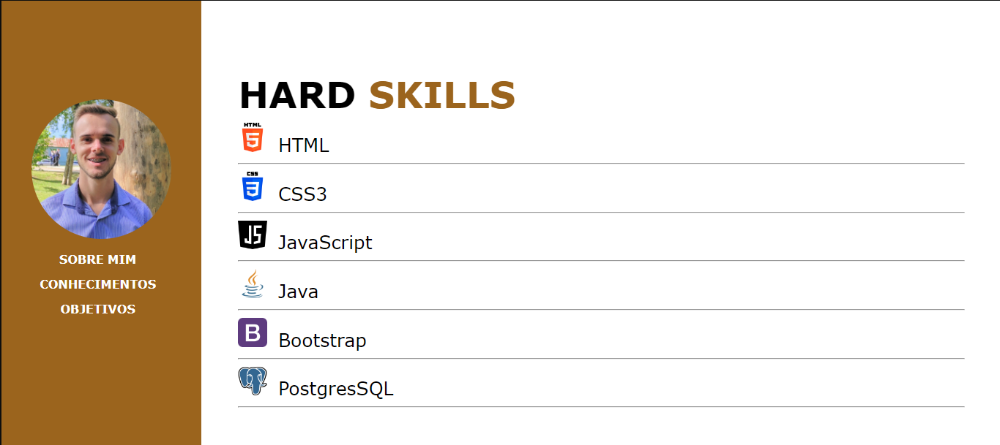
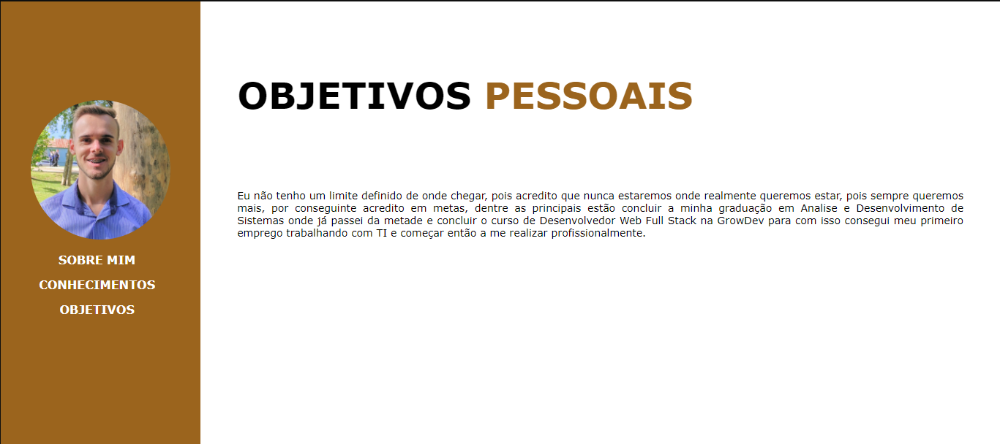

Atividade Pratica da Formação de Web Full Stack da Grodev com objetivo de praticar html e css.

<h2>Pagina sobre mim</h2>

![sobre mim]

<h2>Página conhecimentos</h2>

![conhecimentos]

<h2>Página Objetivos</h2>

![Objetivos]

removido folhas de estilo e adicionado lista nas paginas conhecimentos e objetivos, para se adequar ao que foi solicitado na atividade

